# Torre del Caribe
## Documento ejecutivo del proyecto

**Universidad Nacional Rosario Castellanos** · Licenciatura en Ciencias de Datos para Negocios · 5° semestre, 2026-2
Problema Prototípico: *Turismo inteligente sustentable para México* · Estado: **Quintana Roo**
Responsable técnico: **Brandon Uriel García Sánchez**

> **Para quién es este documento.** Explica, sin tecnicismos, qué hace cada parte del sistema, por qué se construyó así
> y qué resultados dio. Sirve de base para redactar el informe final y preparar el coloquio. Cada cifra lleva su
> fuente oficial. Los términos técnicos se explican la primera vez que aparecen y se resumen en el glosario del final.

---

## 1. De qué trata el proyecto

Quintana Roo recibe millones de turistas al año, pero casi todos se concentran en pocos lugares: Cancún, Playa del
Carmen y Tulum. Esos destinos se saturan, mientras que otros lugares del mismo estado, con cultura, naturaleza y
capacidad para recibir visitantes, casi no se visitan.

El proyecto diseña una **campaña publicitaria basada en datos** que invita a una parte de esos turistas a conocer
destinos del sur y del interior del estado, sin llevar la saturación a esos nuevos lugares. Para que cada decisión de
la campaña esté respaldada con evidencia, se construyó un sistema que:

1. **Reúne datos oficiales** de turismo, clima, huracanes, población, negocios y reseñas de viajeros.
2. **Mide dónde hay presión y dónde hay espacio** ("Radar").
3. **Anticipa cuándo conviene ir y cuánto invertir**, con rangos de incertidumbre ("Pronóstico").
4. **Vigila semana a semana** si la campaña debe seguir, bajar de intensidad o pausarse ("Torre en vivo").
5. **Muestra todo en una página web** pensada para cualquier persona, no solo para especialistas.

---

## 2. El problema en números: ¿a dónde van los turistas?

La forma más directa de ver la concentración es contar cuántas personas visitan cada zona arqueológica, porque el
Instituto Nacional de Antropología e Historia (INAH) registra a cada visitante que entra.

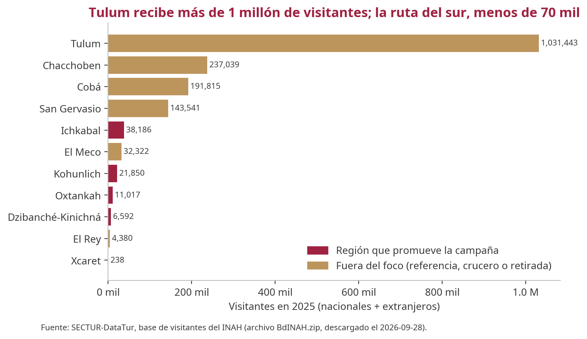

*Figura 1. Visitantes por zona arqueológica en 2025. Fuente: SECTUR-DataTur, base de visitantes del INAH.*

**Qué muestra la gráfica:**
- **Tulum** recibió **1,031,443 visitantes** en 2025. Las tres zonas de la ruta arqueológica del sur (Kohunlich,
  Dzibanché e Ichkabal) sumaron **66,628**: Tulum recibió **15.5 veces más**.
- **Kohunlich** recibió 21,850 visitantes en 2025, pero en 2019 había recibido 42,813. Es decir, hoy usa la mitad de
  lo que ya demostró poder recibir: tiene **49.0 % de capacidad probada sin usar**.

- **Chacchoben** y **San Gervasio** tienen muchos visitantes, pero más del 90 % son pasajeros de crucero, por eso no
  se consideran destinos a promover.

**Cómo se calcularon estas cifras** (el detalle está en `docs/metodologia/ECUACIONES.md`):

- Veces que Tulum supera a la ruta del sur: 1,031,443 ÷ 66,628 = **15.5**
- Capacidad probada sin usar de Kohunlich: 1 − (21,850 ÷ 42,813) = 1 − 0.510 = **0.490 → 49.0 %**
- Cambio de Tulum entre enero–julio 2025 y enero–julio 2026: (476,247 ÷ 692,946 − 1) × 100 = **−31.3 %**

### 2.1 Qué regiones promueve la campaña

Para elegir las regiones se aplicaron cinco criterios:
1. que no estén en la franja de playas afectadas por el **sargazo** (alga que llega a la costa y la cubre) en 2026;
2. que no tengan cierres de negocios o crisis reportadas en 2026;
3. que no estén ya saturadas;
4. que su ecosistema y sus servicios (agua, basura) aguanten más visitantes;
5. que existan datos oficiales para medirlas.

En 2026 el sargazo rompió récord: se recogieron más de 104,700 toneladas y 56 de las 140 playas del estado estaban en
rojo en agosto. Tulum reportó caídas de ventas de hasta 60 % y cierres de negocios. Por eso la campaña **no promueve
playa**, sino una ruta de cultura, bahía, laguna y comunidades. El proyecto se concentra en **cinco regiones**, sin
sargazo en su costa, sin cierres y sin saturación:

| Destinos que promueve la campaña | Municipio | Condición |
|---|---|---|
| Chetumal (ciudad) | Othón P. Blanco | Vigilar sargazo: en septiembre de 2026 apareció en los canales de entrada de la bahía |
| Bahía de Chetumal: Calderitas y Oxtankah | Othón P. Blanco | Mismo riesgo de la bahía |
| Ruta arqueológica del sur (Kohunlich, Dzibanché, Ichkabal) | Othón P. Blanco | Sin riesgo relevante |
| Maya Ka'an interior y Kantemó | Felipe Carrillo Puerto y José María Morelos | Turismo comunitario con poca oferta instalada: límite de visitantes |
| Laguna Milagros y Xul-Ha | Othón P. Blanco | Laguna frágil (el mismo sistema que Bacalar): límite estricto de visitantes; sin estadística turística propia |

Cuatro de las cinco regiones están en el mismo municipio, así que la campaña puede ofrecerlas como un solo viaje.

Primero se consideraron también Cobá, Muyil y la Ribera del Río Hondo. Se retiraron porque Cobá pertenece al
municipio de Tulum, Muyil estuvo cerrada de junio de 2024 a febrero de 2026 y colinda con Tulum, y el Río Hondo no
tiene ninguna estadística turística propia.

**Cancún, Riviera Maya y Tulum** no se promueven ni aparecen en las piezas de la campaña. Se usan **solo como
referencia**: ahí están hoy los turistas a quienes les habla la campaña, y son el punto de comparación para medir la
saturación.

---

## 3. Preparación del equipo de cómputo (Fase 0)

Antes de trabajar con los datos se preparó la computadora. Parte de la información es grande: por ejemplo, el
directorio de negocios del INEGI de todo el país ocupa cientos de megabytes. Para procesarla se usa **PySpark**, una
herramienta diseñada para datos que no caben cómodamente en la memoria de una computadora, porque divide el trabajo
en partes y las procesa en paralelo.

**Qué se instaló y por qué:**

| Componente | Para qué sirve | Por qué esa versión |
|---|---|---|
| **Python 3.11** en un entorno propio (`.venv`) | Lenguaje en el que está escrito todo el sistema | El entorno propio evita que otros programas de la computadora cambien las librerías del proyecto |
| **PySpark 3.5.6** | Procesar volúmenes grandes de datos | Es la versión compatible con Windows y con Java 17 |
| **Java 17** | PySpark funciona sobre Java | La computadora solo tenía Java 8, que PySpark ya no acepta; Java 17 se usa solo dentro del proyecto, sin afectar otros programas |
| **winutils y hadoop.dll** | Permiten que PySpark guarde archivos en Windows | Sin ellos, PySpark no puede escribir resultados en disco |

**Prueba de funcionamiento.** Se creó una prueba automática: el sistema lee una tabla pequeña, la guarda en formato
**Parquet** (un formato que guarda tablas comprimidas y rápidas de leer) y la vuelve a leer. La prueba pasó en 22.9
segundos, y la suma de control (1 + 2 + 3 = 6) coincidió, lo que confirma que lo guardado es idéntico a lo leído.

---

## 4. Recolección de los datos oficiales (Fase 1)

### 4.1 Qué se hizo
El sistema descarga automáticamente la información de **15 fuentes oficiales** y la guarda **tal como la publica
cada fuente**, sin cambiar nada. A ese primer depósito se le llama **Bronze**. Guardar los datos originales permite
comprobar en cualquier momento de dónde salió cada cifra.

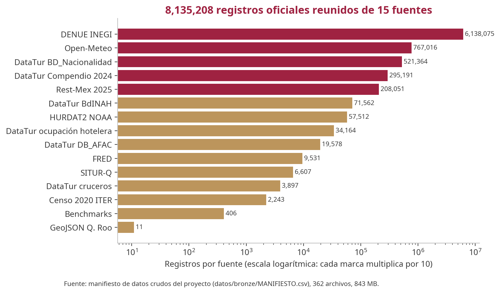

*Figura 2. Registros por fuente oficial. Fuente: manifiesto de datos crudos del proyecto.*

En total se reunieron **353 archivos** con **8,134,802 registros** (824 MB). Con las tablas de costos publicitarios que se agregaron al cerrar la fase (sección 4.6), el depósito suma 362 archivos y 8,135,208 registros, que es lo que muestra la figura. Las fuentes más grandes son:
- **DENUE del INEGI:** 6,138,075 negocios de todo el país, con su ubicación. Sirve para saber cuántos hoteles,
  restaurantes y servicios turísticos hay en cada lugar.
- **Clima (Open-Meteo):** 767,016 registros de temperatura, lluvia y viento en 8 lugares de Quintana Roo; por hora
  desde 2019 y por día desde 1950.
- **Llegadas por nacionalidad (DataTur):** 521,364 registros de visitantes extranjeros por país, sexo y aeropuerto
  de llegada (Cancún, Cozumel, Chetumal y Tulum).
- **Reseñas de viajeros (Rest-Mex 2025):** 208,051 opiniones; 85,993 son de Quintana Roo.

### 4.2 Cómo se garantiza que los datos son los originales
Cada archivo queda anotado en un **manifiesto** (una tabla de control) con cinco datos:
1. de dónde se descargó (dirección web),
2. cuándo se descargó,
3. cuánto pesa,
4. cuántos registros tiene,
5. su **huella digital** (SHA-256): un código único que cambia si se altera aunque sea un dato.

Una prueba automática recalcula las huellas de los 353 archivos y confirma que ninguno fue modificado.

### 4.3 Cómo se comprobó que la descarga es correcta
Además de las huellas, el sistema verifica cifras que ya se conocían por otras consultas oficiales. Todas coincidieron:

| Cifra verificada | Valor |
|---|---|
| Ocupación hotelera de Bacalar, enero 2024 (SITUR-Q) | 66.5 % |
| Pasajeros del Tren Maya en la Gran Costa Maya, enero 2025 (SITUR-Q) | 14,437 |
| Hoteles en Bacalar, enero 2025 (SITUR-Q) | 145 |
| Reseñas del corpus Rest-Mex 2025 | 208,051 |
| Visitantes a la zona arqueológica de Tulum, 2025 (INAH) | 1,031,443 |
| Municipios de Quintana Roo en el mapa | 11 |

### 4.4 Qué datos NO existen (y cómo se maneja)
Una regla del proyecto es **no inventar datos**: si algo no existe, se declara.

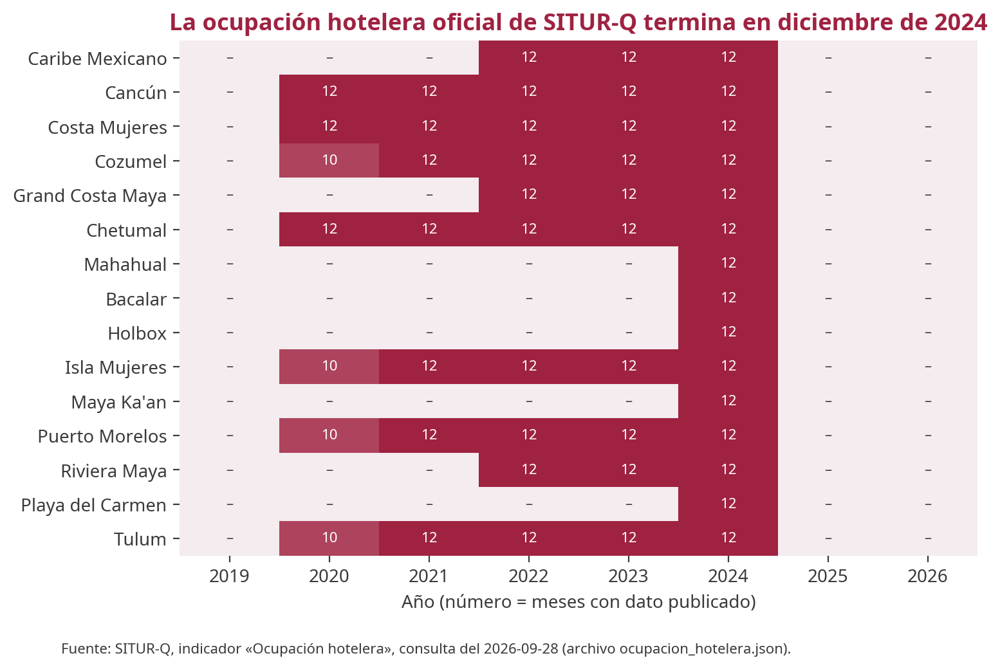

*Figura 3. Meses con ocupación hotelera publicada por destino y año. Fuente: SITUR-Q.*

- **La ocupación hotelera oficial del estado (SITUR-Q) termina en diciembre de 2024** para todos los destinos. Para
  2025 y 2026 solo hay datos semanales de DataTur, y únicamente de 7 centros del norte (Cancún, Cozumel, Isla Mujeres,
  Riviera Maya, Akumal, Playa del Carmen y Playacar).
- La afluencia de turistas y la derrama económica publicadas llegan hasta marzo de 2024.
- Uno de los indicadores de SITUR-Q ("Turista - Afluencia") no responde en el servidor de la fuente; queda registrado
  como dato no disponible.

Estos huecos se toman en cuenta en las siguientes fases. Donde falte la ocupación, la presión turística se medirá con
datos que sí existen hasta 2026: pasajeros del Tren Maya, cruceristas, cruces fronterizos con Belice y número de
habitaciones.

### 4.5 Problemas técnicos que se resolvieron
- **El servidor de SITUR-Q solo acepta consultas que vienen de su página.** El sistema se identifica igual que un
  navegador que visita el tablero público.
- **El directorio de negocios del Estado de México viene dividido en dos archivos.** El sistema busca las partes
  automáticamente.
- **El servicio de clima limita cuántos datos se piden por minuto.** El sistema pide los datos por años y, si el
  servicio pide esperar, espera y vuelve a intentar.

### 4.6 Cuánto cuesta anunciarse en internet
Para repartir el presupuesto de la campaña entre canales hace falta saber cuánto cuesta cada clic y cuántas personas
dan clic. Esas cifras las publican WordStream y LocaliQ, dos empresas de publicidad digital, con promedios por industria.
Sus páginas no permiten descargas automáticas simples, así que el sistema usa un **navegador automatizado**
(Playwright): un programa que abre la página igual que una persona, copia las tablas y guarda una captura de pantalla
como prueba.

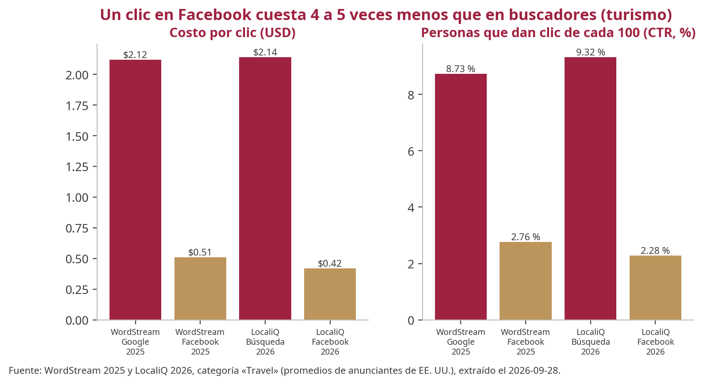

*Figura 4. Costo por clic y tasa de clics en la categoría «Travel». Fuente: WordStream 2025 y LocaliQ 2026.*

**Qué muestra la gráfica:**
- Un clic en **buscadores** (Google) cuesta cerca de **$2.12–$2.14 dólares**; en **Facebook**, **$0.42–$0.51**. Es
  decir, de 4 a 5 veces menos.
- En cambio, en buscadores dan clic **8.7–9.3 de cada 100 personas** que ven el anuncio, y en Facebook solo 2.3–2.8.
  Lo barato de Facebook se compensa en parte con menos clics.
- **Límite de estos datos:** son promedios de anunciantes de Estados Unidos, así que se usan como una referencia y no
  como un costo medido en México. Tampoco existe una cifra publicada de cuántas personas terminan reservando después de
  dar clic en Facebook para turismo; esa parte se trata como un supuesto en la etapa de optimización del presupuesto.

### 4.7 Vigilancia del sargazo en la Bahía de Chetumal
Dos de los destinos que promueve la campaña (Chetumal y Calderitas–Oxtankah) están en la Bahía de Chetumal. En
septiembre de 2026 hubo reportes de sargazo cerca de la bahía, así que se revisó la evidencia disponible.

El semáforo oficial diario del sargazo del Gobierno de Quintana Roo se publica solo en Facebook, y las reglas de esa red
social no permiten copiar su contenido de forma automática. Por eso el sistema guardó como evidencia las publicaciones
públicas de El Colegio de la Frontera Sur (ECOSUR, un centro de investigación con sede en Chetumal) y de medios locales.

**Situación al 28 de septiembre de 2026:**
- Hay sargazo en los **canales que conectan la bahía con el mar Caribe** (Canal de Zaragoza y río Bacalar Chico, en la
  frontera con Belice), en el extremo opuesto a la ciudad.
- Especialistas advierten que podría moverse hacia el interior de la bahía, pero **no hay reportes en la costa de
  Chetumal ni de Calderitas**.
- Por eso ambos destinos se mantienen, **con vigilancia**: si el sargazo llega a su costa, el sistema de seguimiento
  semanal de la campaña pausa su promoción.

---

## 5. Limpieza y orden de los datos (Fase 2, en curso)

### 5.1 Qué se hace y por qué
Los datos descargados llegan en formatos muy distintos: respuestas de un sistema web, hojas de Excel con encabezados y
notas al pie, archivos comprimidos. En este paso el sistema los convierte en **tablas uniformes**, con los mismos
nombres de columna, las fechas en el mismo formato y los datos faltantes marcados como tales. A este segundo depósito
se le llama **Silver**. El trabajo lo hace **PySpark**, la herramienta para volúmenes grandes preparada en la Fase 0.

Al mismo tiempo empezó la construcción de la página web, para que el avance visual acompañe al de los datos.

### 5.2 Reglas de limpieza (cada una comprobada con los datos)
- **Tren Maya:** algunos destinos tienen dos estaciones y la fuente las reporta por separado. Se suman. La prueba de que
  es correcto es que la suma coincide exactamente con el total que la misma fuente publica para toda la zona: por
  ejemplo, en enero de 2025 bajaron del tren 7,084 personas en la Gran Costa Maya, igual a las de Chetumal (3,502) más
  las de Bacalar (3,582).
- **Casillas vacías que parecen ceros:** para 2025, el sistema estatal reporta "0 habitaciones disponibles" en todos los
  destinos, lo cual es imposible. Esos ceros se guardan como **dato faltante**, no como ocupación de 0 %. Lo mismo pasa con la
  afluencia de turistas y la derrama económica: un mes con cero turistas es imposible, así que también es dato faltante.
  En cambio, los ceros reales se conservan, como los cruceristas de 2020, cuando los puertos cerraron por la pandemia.
- **Vuelos que dejaron de publicarse:** desde enero de 2025, los cuatro aeropuertos del estado (Cancún, Cozumel,
  Chetumal y Tulum) aparecen con cero pasajeros todos los meses. Es imposible: en 2025 los hoteles de Cancún tuvieron
  en promedio 72 % de sus cuartos ocupados cada semana. La regla es que un mes se marca como dato faltante solo si **todos** los
  aeropuertos marcan cero a la vez; si uno trae dato, ningún cero de ese mes se toca. Así quedaron 114 meses-aeropuerto
  como faltantes, todos de 2025 y 2026. Por eso la página usa 2024 como el último año completo de vuelos.
- **Cifras corregidas por la fuente:** SECTUR publica cifras preliminares y después las corrige. Cuando una misma semana
  aparece en varios archivos, se usa la versión más reciente. Hubo 2,804 cifras semanales corregidas.
- **Notas de advertencia de la fuente:** algunos centros traen notas como *"a partir de septiembre de 2025 se actualizó
  la oferta hotelera, por lo que los datos no son estrictamente comparables"* (Isla Mujeres). El sistema guarda esas
  notas junto al dato para tomarlas en cuenta más adelante.

### 5.3 Un hallazgo: más historia de la que se esperaba
Cada archivo semanal de SECTUR compara tres años de la misma semana, así que la ocupación hotelera semanal cubre
**de enero de 2022 a julio de 2026**: 239 semanas completas para cada uno de los 7 centros turísticos de Quintana Roo.

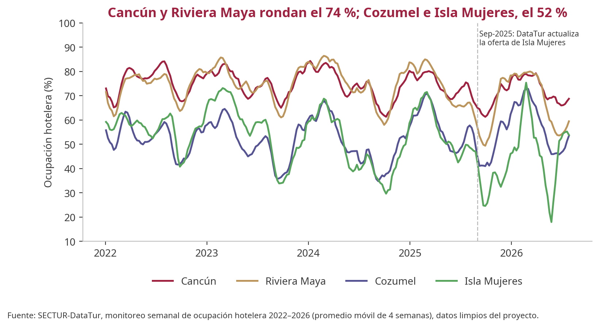

*Figura 5. Ocupación hotelera semanal, 2022–2026 (promedio de 4 semanas). Fuente: SECTUR-DataTur.*

**Qué muestra la gráfica:**
- **Cancún y Riviera Maya** se mueven alrededor del 74 % de ocupación, con picos cercanos al 85 % en temporada alta.
- **Cozumel e Isla Mujeres** promedian cerca del 52 %.
- A mediados de 2026, **Riviera Maya cae** con fuerza, lo que coincide con la crisis del sargazo documentada en el
  capítulo 2.

### 5.4 Los negocios turísticos de cada municipio
El directorio de negocios del INEGI (DENUE) se limpió completo: **6,138,075 negocios de todo el país**, sin ningún
duplicado y todos con coordenadas dentro del territorio nacional. Es la tabla más grande del proyecto y la que justifica
usar PySpark: el sistema la procesa en cerca de un minuto y medio.

Para saber qué negocios atienden a turistas se usó el criterio de la Secretaría de Turismo y el INEGI, que clasifica
los negocios por giro (código SCIAN). Cuentan como turísticos seis giros: alojamiento, alimentos y bebidas, agencias
de viajes, transporte turístico, museos y sitios históricos, y esparcimiento. Con ese criterio:
- En el país hay **875,667 negocios turísticos** (14.3 % de todos los negocios).
- En Quintana Roo hay **13,663** (19.7 % de sus 69,260 negocios): el turismo pesa más en este estado que en el promedio
  nacional.
- En Quintana Roo, 10,755 son de alimentos y bebidas y 1,439 de alojamiento.

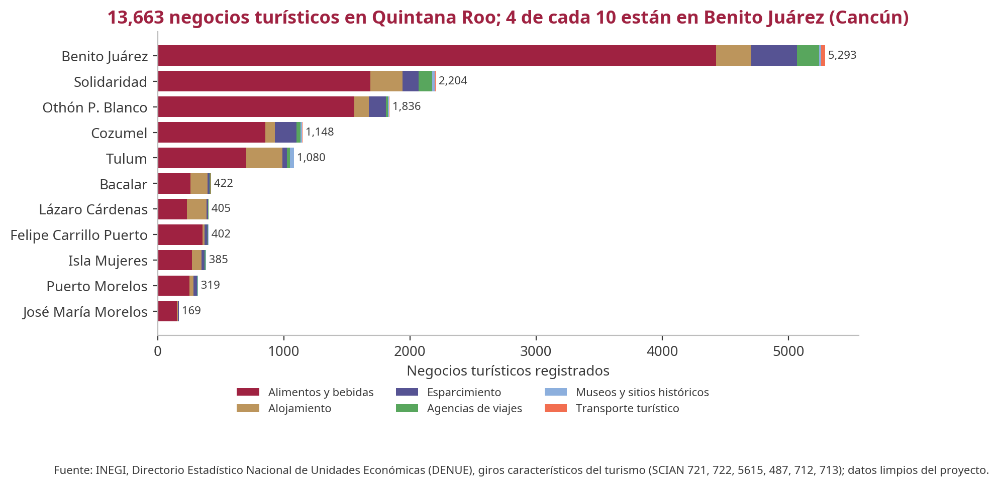

*Figura 6. Negocios turísticos por municipio y giro. Fuente: INEGI, DENUE; datos limpios del proyecto.*

**Qué muestra la gráfica:**
- **Benito Juárez (Cancún)** concentra 5,293 negocios turísticos, **4 de cada 10** del estado.
- **Othón P. Blanco**, el municipio de Chetumal y Calderitas, es el tercero con 1,836: ya existe una base de
  restaurantes y hoteles que puede recibir a más visitantes sin construir nada nuevo.
- **Felipe Carrillo Puerto** (402) y **José María Morelos** (169), corazón de la región Maya Ka'an, tienen muy pocos
  negocios. Ahí la campaña debe cuidar que la llegada de visitantes no rebase lo que la comunidad puede atender.

**Privacidad:** el directorio público incluye la razón social, el teléfono y el correo de cada negocio. Esas tres
columnas **no se guardan** en la tabla limpia, porque el proyecto no las necesita.

### 5.5 Cuando las fuentes no coinciden
Algunas noticias de 2026 reportaron que Isla Mujeres estaba al 93.5 % de ocupación en febrero y al 95 % en abril. La
fuente oficial (SECTUR-DataTur) registra **74.7 % y 43.2 %** en esos meses. El proyecto sigue una regla: **el dato
oficial tiene prioridad sobre la nota de prensa**. Isla Mujeres sigue fuera de la campaña, porque el proyecto se
concentra en cinco regiones del sur y Maya Ka'an; el caso se conserva como ejemplo de fuentes que no coinciden.

### 5.6 Clima, huracanes y tipo de cambio: lo que necesita el Pronóstico
El pronóstico de los próximos meses (Fase 5) necesita tres datos externos: cuánto llueve, cuándo llegan las tormentas
y cuánto vale el dólar. Los tres quedaron limpios el 30 de septiembre de 2026.

**Huracanes.** La NOAA (agencia del clima de Estados Unidos) registra cada tormenta del Atlántico desde 1851, con su
posición cada seis horas. Son 55,524 posiciones de 1,988 tormentas. El proyecto midió la distancia de cada posición a
Chetumal y fijó qué cuenta como una tormenta que **afecta al sur**: pasar a 200 km o menos de Chetumal con viento de
tormenta tropical o más (34 nudos, unos 63 km/h). Solo se cuentan las de 1966 en adelante, cuando empezó la vigilancia
por satélite. Antes se perdían tormentas en el mar y la cuenta saldría baja.

Resultado: **31 tormentas en 60 años**, es decir, una cada dos años aproximadamente. Entre ellas están el huracán
Carmen (1974), que pasó a 15 km de Chetumal, y el huracán Dean (2007), que tocó tierra a 67 km con vientos de
150 nudos.

**Clima.** Se limpiaron 76 años de clima diario (1950–2026) y 7 años de clima hora por hora (2019–2026) en ocho puntos
del estado: 224,232 días y 542,784 horas, sin un solo hueco. Los datos vienen de Open-Meteo, que publica un
reanálisis: un modelo meteorológico que combina observaciones reales. Laguna Milagros y Calderitas no tienen un punto
propio; se usa el de Chetumal, que está a entre 8 y 19 km de ellas.

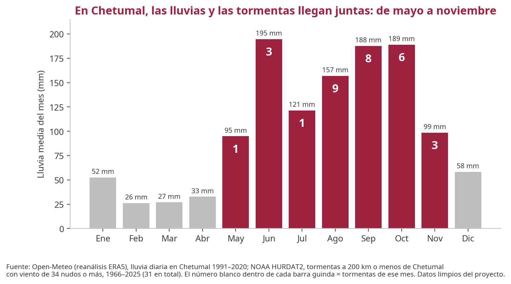

La gráfica muestra el primer patrón útil para la campaña: **los meses secos (diciembre a abril) no tienen tormentas**, y
de mayo a noviembre llegan juntas la lluvia y las tormentas. Agosto, septiembre y octubre concentran 23 de las 31
(el 74 %). La Fase 5 convierte esto en una probabilidad por mes.

**Tipo de cambio.** La Reserva Federal de St. Louis publica el precio del dólar en pesos para cada día hábil desde
1993: 8,575 días. Los 336 feriados de Estados Unidos vienen vacíos y **se quedan vacíos**; no se copia el precio del
día anterior. El promedio de cada mes se calcula solo con los días que sí tienen precio, y se anota cuántos fueron. En
agosto de 2026 el promedio fue de 17.06 pesos por dólar, con 21 días.

**Dos detalles de calidad.**
- El archivo oficial de huracanes trae dos líneas mal escritas. En una falta indicar si la latitud es norte o sur; el
  proyecto la deja vacía en lugar de adivinarla. Las dos están a más de 3,000 km de Chetumal y no cambian la cuenta.
- Durante la revisión se encontró que la primera exploración se saltaba una de esas líneas sin avisar. El código final
  no se salta nada: si una línea no se entiende, se detiene.

### 5.7 Avance
- **Listo:** sistema estatal de indicadores, ocupación hotelera de SECTUR (2022–2026), directorio de negocios del INEGI
  (6.1 millones), zonas arqueológicas del INAH, población del Censo 2020, huracanes, clima y tipo de cambio.
- **Sigue:** nacionalidades, reseñas, vuelos y cruceros (se necesitan en la Fase 8, la campaña); el catálogo de datos y
  la base de consultas rápidas (Fase 9).

---

## 6. La página web

### 6.1 Para quién es y cómo se diseñó
La página es la cara pública de la campaña. La leerán turistas, autoridades y el jurado del coloquio, y casi ninguno
tiene formación técnica. Se diseñó con la herramienta de diseño de Claude (Claude Design) bajo una identidad llamada
**"Sur mexicano"**:
- **Colores mexicanos en bloques,** como en la arquitectura de Luis Barragán: rosa mexicano, amarillo cempasúchil,
  turquesa del Caribe y añil, sobre un fondo color cal.
- **Letras con carácter:** Bricolage Grotesque, de voz de cartel, para los títulos, y Figtree para leer. Las fuentes
  van dentro del proyecto, así que la página funciona sin internet.
- **Una greca escalonada,** inspirada en el perfil de las pirámides mayas del sur, separa las secciones.
- **Fotos grandes y poco texto:** cada sección dice una sola cosa.

Todas las cifras salen de las tablas limpias del proyecto. Cuando un lugar no tiene un dato oficial, la página
escribe "sin dato".

### 6.2 La portada y el dato
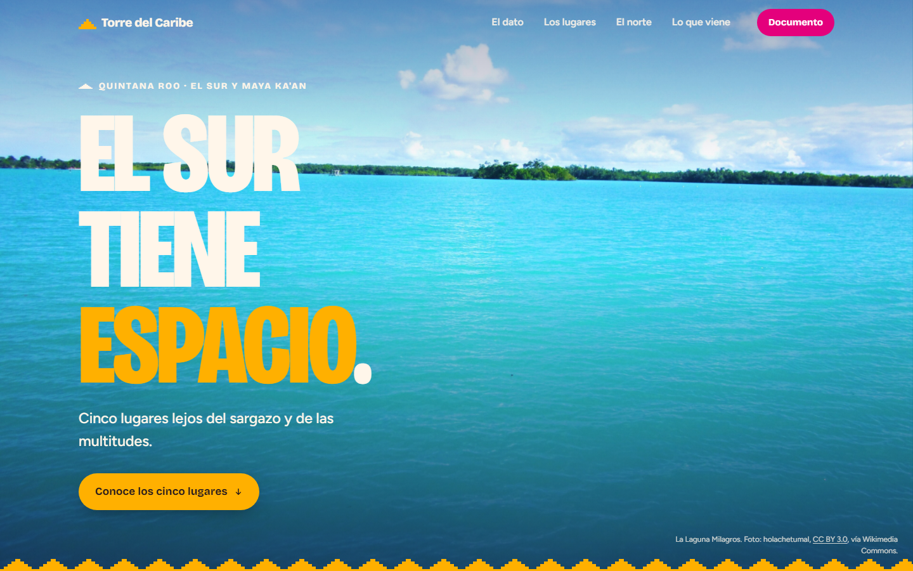

*Captura 1. Portada: la Laguna Milagros y el mensaje principal. Foto: holachetumal, CC BY 3.0, Wikimedia Commons.*

El mensaje principal es **"El sur tiene espacio."** La sección siguiente lo demuestra con una cifra medida: en 2024,
los hoteles de Chetumal ocuparon 458,696 de las 791,016 noches de cuarto disponibles (58 %). Es decir, **4 de cada 10
cuartos se quedaron vacíos**. Un dibujo de diez cuartos, seis llenos y cuatro vacíos, lo hace visible de un vistazo.

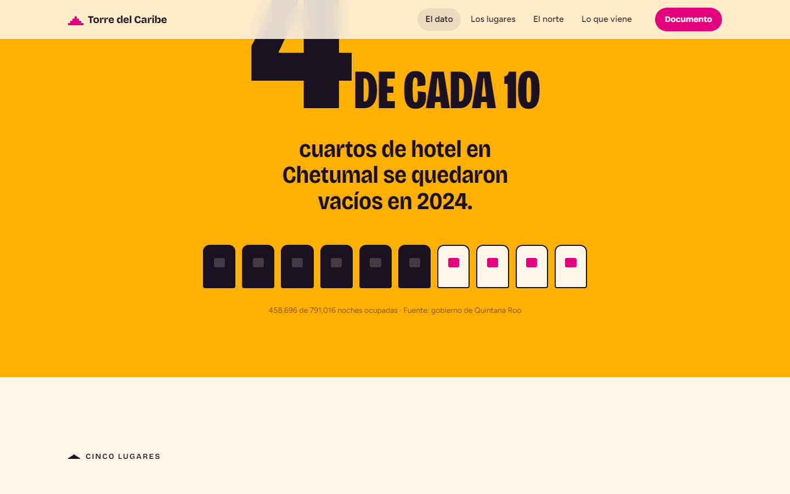

*Captura 2. "El dato", con el dibujo de los diez cuartos. Fuente: gobierno de Quintana Roo.*

### 6.3 Los cinco lugares
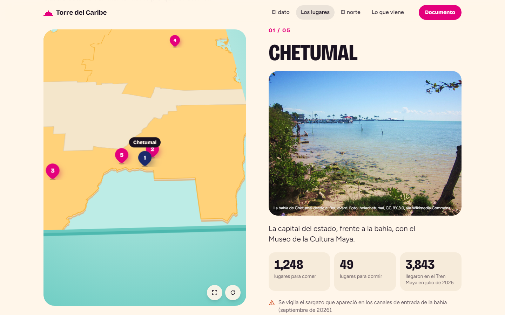

*Captura 3. A la izquierda, la maqueta 3D del sur de Quintana Roo; a la derecha, el primer lugar. Fuentes: INEGI,
INAH y gobierno de Quintana Roo.*

Mientras el lector baja por la página, el mapa se queda fijo y vuela hacia el lugar que está leyendo. El mapa se puede
girar arrastrándolo, y al tocar un número la página salta a ese lugar. Cada lugar tiene una foto, una frase, tres
cifras y un aviso de cuidado:

| Lugar | Cifras que muestra |
|---|---|
| Chetumal | 1,248 lugares para comer · 49 para dormir · 3,843 llegaron en tren (julio de 2026) |
| Calderitas y Oxtankah | 11,017 visitantes a Oxtankah (2025) · 62 para comer · 5 para dormir |
| Ruta de las pirámides | 66,628 visitantes (2025) · 64 para comer · 0 para dormir |
| Maya Ka'an | 345 para comer · 15 para dormir · 340 llegaron en tren (julio de 2026) |
| Laguna Milagros y Xul-Ha | 0 para comer · 1 para dormir · sin dato oficial de turistas |

**Una decisión de honestidad:** una versión anterior destacaba que Kohunlich (+13.5 %) y Dzibanché (+69.2 %) ganaron
visitantes en 2026. Pero la ruta completa bajó 8.2 %, porque Ichkabal cayó 27.5 %. Mostrar solo las dos zonas que
suben habría sido escoger los datos a conveniencia, y por eso se quitó.

### 6.4 Cómo se comprobó que los lugares son de Quintana Roo, y de dónde salen las fotos
Algunos nombres se repiten en otros lugares: hay un Xul-Ha en Puerto Morelos y un Felipe Carrillo Puerto en
Solidaridad. Por eso cada pueblo se identificó con su clave oficial del INEGI, no solo por su nombre. Se hicieron tres
pruebas independientes:
- los 11 pueblos aparecen en el Censo 2020 de Quintana Roo;
- las 4 zonas arqueológicas aparecen como "Quintana Roo" en el registro del INAH;
- cada ubicación cae dentro del mapa de su municipio.

Todas las pruebas salieron bien.

Las seis fotos vienen de Wikimedia Commons, un archivo público de fotos con licencia libre. Se pueden usar siempre que
se cite al autor y la licencia, y así aparecen en la página, al pie de cada foto. Cuatro traen su ubicación GPS, y se
comprobó que cada una cae en el municipio correcto; las otras dos se identifican por su título. No se usaron fotos de
buscadores ni de sitios de reseñas, porque sus términos de uso no lo permiten.

### 6.5 Mientras tanto, en el norte
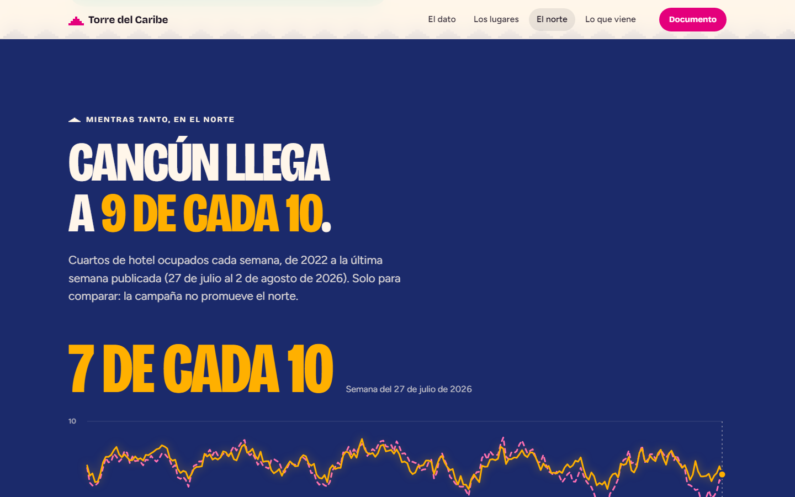

*Captura 4. Ocupación semanal de los hoteles de Cancún y la Riviera Maya, 2022–2026, solo como referencia. Fuente:
Secretaría de Turismo.*

La sección en añil explica por qué la campaña no promueve el norte. Una gráfica recorre semana por semana los hoteles
de Cancún y la Riviera Maya desde 2022, y una cifra grande dice cuántos de cada 10 cuartos estaban ocupados. En su
semana más llena, Cancún tuvo 9 de cada 10. Al final se recuerda que, en Chetumal, 4 de cada 10 cuartos quedaron vacíos
en 2024.

### 6.6 Cómo llega la gente a Quintana Roo
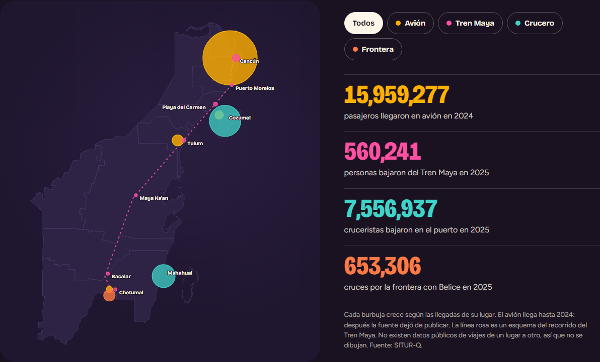

*Captura 5. Mapa de todo el estado con las llegadas por medio de transporte. Fuente: gobierno de Quintana Roo
(SITUR-Q).*

Esta sección muestra por dónde entra la gente al estado. Cada burbuja es un lugar de llegada y su tamaño crece con el
número de personas: el **área** del círculo es proporcional a las llegadas, así que un círculo con el doble de área
representa el doble de gente. Unos botones permiten ver un solo medio de transporte a la vez.

| Medio | Año | Llegadas | Dónde |
|---|---|---:|---|
| Avión | 2024 | 15,959,277 | Cancún 14,769,302 · Tulum 620,384 · Cozumel 352,067 · Chetumal 217,524 |
| Crucero | 2025 | 7,556,937 | Cozumel 4,915,242 · Mahahual 2,641,695 |
| Frontera con Belice | 2025 | 653,306 | Chetumal |
| Tren Maya | 2025 | 560,241 | de Cancún (266,959) a Chetumal (53,825), en 8 estaciones |

**Qué muestra el mapa:**
- **Nueve de cada diez** pasajeros de avión llegan por Cancún. El sur casi no aparece en el mapa aéreo: Chetumal recibe
  el 1.4 %.
- El crucero lleva a millones de personas a Cozumel y Mahahual, dos lugares que la campaña no promueve.
- El Tren Maya y la frontera con Belice son las dos puertas de entrada que sí llegan al sur.

**Tres límites que se declaran en la misma página:**
- Se usa el **último año completo** de cada medio: 2024 para el avión (la fuente dejó de publicar en 2025, ver 5.2) y
  2025 para los demás.
- La línea rosa del tren es un **esquema** que une las estaciones en orden; no es el trazo exacto de la vía.
- **No se dibujan viajes de un lugar a otro** (por ejemplo, cuánta gente va de Cancún a Chetumal) porque ninguna fuente
  pública lo publica. Inventar esas flechas iría contra la primera regla del proyecto.

### 6.7 Dónde se queda el dinero
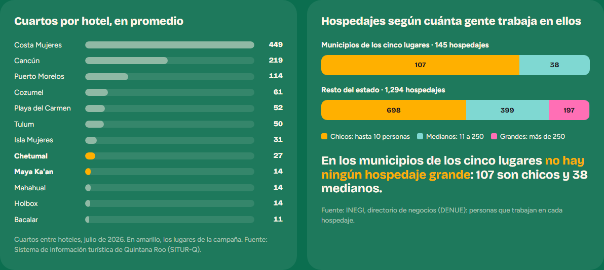

*Captura 6. Tamaño de los hoteles por destino y tamaño de los hospedajes por número de trabajadores. Fuentes:
gobierno de Quintana Roo (SITUR-Q) e INEGI (DENUE).*

La pregunta de fondo es quién se beneficia cuando llega un turista. No existe una fuente pública que diga cuánto gasta
cada turista ni en qué negocio, así que la página responde con lo que sí está medido: **qué tan grandes son los
hoteles**. El tamaño no dice quién es el dueño, pero sí muestra si el hospedaje de un lugar está concentrado en pocos
hoteles grandes o repartido entre muchos pequeños.
- **Cuartos por hotel (julio de 2026):** Costa Mujeres 449, Cancún 219, Chetumal 27 y Maya Ka'an 14. Un hotel típico de
  Cancún tiene ocho veces más cuartos que uno de Chetumal.
- **Hospedajes por número de trabajadores:** en los municipios de los cinco lugares hay 145 hospedajes: 107 chicos (hasta
  10 personas), 38 medianos y **ninguno grande** (más de 250 personas). En el resto del estado hay 197 grandes.

**Un dato que no se muestra:** el sistema estatal publica una serie de "derrama económica" por destino, pero no dice si
está en pesos o en dólares, y el total del estado sale menor que el de Cancún, lo cual es imposible si fueran de la
misma serie. Por eso no se usa, y la página lo dice con un aviso.

### 6.8 Las doce fases
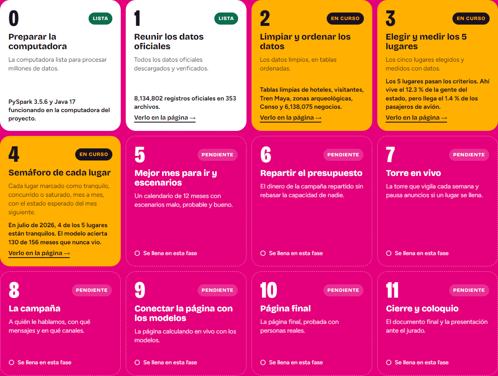

*Captura 7. El avance del proyecto: fases listas en blanco, en curso en amarillo y pendientes con borde punteado.*

La sección rosa muestra las doce fases del proyecto (de la 0 a la 11) como tarjetas. Las fases terminadas o en curso
muestran su resultado real y un enlace a la parte de la página donde se ve; por ejemplo, la Fase 1 muestra los
8,134,802 registros oficiales reunidos. Las pendientes dicen qué van a entregar y "Se llena en esta fase". Además, cada
módulo futuro (semáforo, mejor mes para ir, escenarios, presupuesto, torre en vivo y campaña) ya tiene su espacio
reservado, oculto, que aparece solo cuando su modelo esté listo y probado. Así la página nunca muestra un número que
todavía no existe.

### 6.9 Quiénes somos
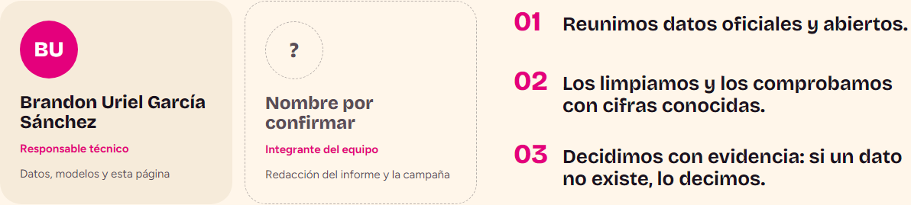

*Captura 8. El equipo y cómo trabaja.*

Presenta al equipo como científicos de datos, estudiantes de la UNRC, y resume su forma de trabajar en tres pasos:
reunir datos oficiales y abiertos, limpiarlos y comprobarlos con cifras conocidas, y decidir con evidencia. Los
nombres del resto del equipo se agregan cuando se confirmen; mientras, su tarjeta dice "Nombre por confirmar".

### 6.10 Preguntas rápidas
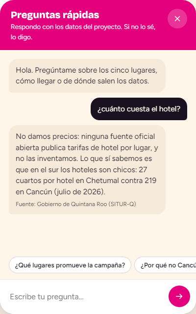

*Captura 9. El asistente de preguntas rápidas respondiendo sobre precios.*

Un botón rosa, fijo en la esquina, abre un asistente de preguntas rápidas. **No es una inteligencia artificial:** cada
respuesta está escrita de antemano con las cifras del proyecto y cita su fuente. El asistente reconoce palabras clave
de la pregunta (por ejemplo, "sargazo", "tren" o "precio") y elige la respuesta que más coincide. Si ninguna coincide,
lo dice y sugiere preguntas. Funciona sin internet.

Un ejemplo de honestidad: a la pregunta "¿cuánto cuesta el hotel?" responde que ninguna fuente oficial abierta publica
precios por lugar y que el proyecto no los inventa; en cambio, ofrece el dato medido del tamaño de los hoteles.

La última sección de la página resume la evidencia: 8,134,802 registros oficiales, 353 archivos verificados y los
cinco lugares comprobados en Quintana Roo.

### 6.11 Tres secciones más y una revisión de diseño (30 de septiembre de 2026)
- **Anuncio del Radar.** Una franja arriba de todo resume el Radar del último mes, por ejemplo: "julio de 2026: 4 de
  los 5 lugares del sur, tranquilos". El texto sale de los datos, no se escribe a mano.
- **El problema en una imagen.** Justo después de "el dato", unas barras muestran la parte del turismo del estado que
  llega a los cinco lugares (1.4 % de los pasajeros de avión, 1.7 % de los cuartos y 4.1 % de los visitantes
  arqueológicos) contra su parte de la gente (12.3 %).
- **Cómo se probó.** La sección final explica, en lenguaje sencillo, cómo se puso a prueba cada resultado: el modelo
  contra "igual que el mes pasado", la cadena de Markov, el agrupamiento de los centros del país, las pruebas
  automáticas y la lista de lo que no se sabe.
- **Revisión de diseño.** Se revisó toda la página en computadora y celular y se corrigieron ocho detalles:
  - la letra de los botones del mapa;
  - el contraste de dos textos pequeños;
  - el tamaño de los créditos de las fotos;
  - un recurso visual que se veía "hecho por IA";
  - las comillas;
  - el tamaño de dos botones para tocarlos con el dedo;
  - el contorno visible al escribir en el chat.

### 6.12 Planea tu viaje y qué hacer (1 de octubre de 2026)
La página ya sirve para planear un viaje. La persona elige uno de los cinco lugares y un mes, de octubre de 2026 a
diciembre de 2027. La página le dice cómo va a estar ese mes: **tranquilo**, **normal** o **temporada alta**. También le
dice cuánta gente se espera, la lluvia y la temperatura de un mes normal, y la probabilidad de tormenta. Los botones de
los meses se pintan del color de su temporada, así que de un vistazo se ve cuándo conviene ir.

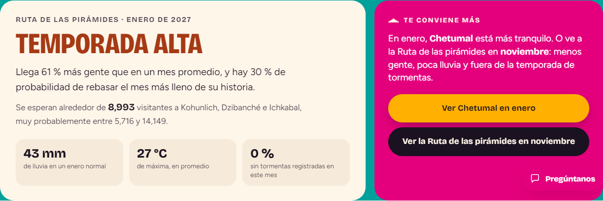

**Cuándo recomienda otra cosa.** Un mes es temporada alta si llega 20 % o más gente que en un mes promedio, o si hay 10 %
o más de probabilidad de rebasar el mes más lleno que el lugar ha tenido. En ese caso la página propone dos salidas:
- otro de los cinco lugares que ese mes esté más tranquilo;
- otro mes para el mismo lugar con menos gente, poca lluvia y fuera de la temporada de tormentas.

Por ejemplo, en enero de 2027 la Ruta de las pirámides recibiría 61 % más gente que en un mes promedio. La página sugiere
Chetumal ese mismo mes, o la Ruta en noviembre. Así se hace visible para el viajero la redistribución que pide el
problema: quien iba a llegar a un lugar lleno ve una alternativa en el sur. Para Maya Ka'an y la Laguna Milagros no hay
estadística oficial de visitantes, y la página lo dice en lugar de adivinar.

**Qué hacer de día, de tarde y de noche.** Justo debajo aparece qué hacer en el lugar elegido, en tres bloques: de día,
por la tarde y de noche. Al bajar, el fondo pasa de un cielo claro a uno naranja y luego al azul de la noche. Un sol
pierde sus rayos, se vuelve atardecer y termina en luna. Cada bloque muestra qué hacer, dónde comer y, en la noche,
dónde dormir.

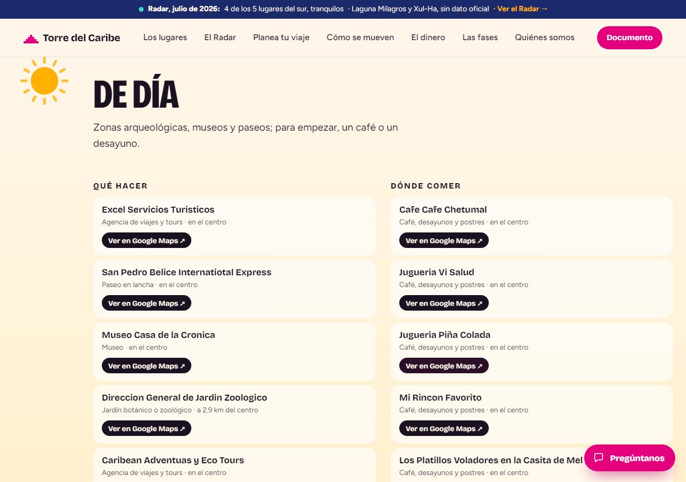

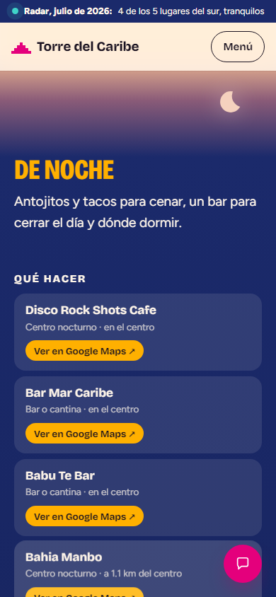

**De dónde salen los lugares.** Son negocios reales del Directorio de negocios del INEGI (DENUE), con su nombre y su
ubicación oficial. Cada tarjeta abre Google Maps en otra pestaña para llegar.
- **No se copió información de Google Maps ni de otros sitios.** Sus términos de uso lo prohíben, y las reglas del
  proyecto también.
- Las reseñas de viajeros disponibles no cubren estos cinco lugares.

**El clasificador de texto.** Para saber qué es cada negocio, un programa lee su nombre y su giro oficial. Una
"Marisquería" va a comer por la tarde, un "Bar" a la noche y un "Museo" al día. Este tipo de programa se llama
clasificador de texto por diccionario.
- **Se revisó a mano.** Varios casos salieron mal y se corrigieron: unas "micheladas" parecían una heladería (la palabra
  contiene "helad") y un estacionamiento de hotel parecía hotel.
- **Qué tan bien funciona.** En una revisión nueva de 40 negocios al azar acertó 39.
- **Qué se dejó fuera.** Lo que no le sirve a un visitante: negocios sin nombre, cafeterías escolares, gimnasios y
  centros para adultos.
- **Límites que se declaran.** El directorio no publica horarios ni calificaciones. Los lugares se ordenan por
  cercanía, no por calidad, y la página invita a confirmar antes de ir.

### 6.13 Una página que empieza por el viaje (1 de octubre de 2026)
La página se reorganizó para que lo primero sea planear el viaje:
- Al entrar, la persona elige uno de los cinco lugares y un mes. La foto de la portada cambia al lugar elegido.
- Justo debajo ve cómo va a estar ese mes y las fotos del lugar.
- Después, qué hacer de día, de tarde y de noche, y dónde comer y dormir.
- Luego, los cinco lugares en el mapa.

Todo lo técnico (el Radar, los datos de llegadas, el dinero, las fases y las pruebas) quedó al final, en una parte
llamada "Los datos", para quien quiera revisar cómo se sabe lo que se dice arriba.

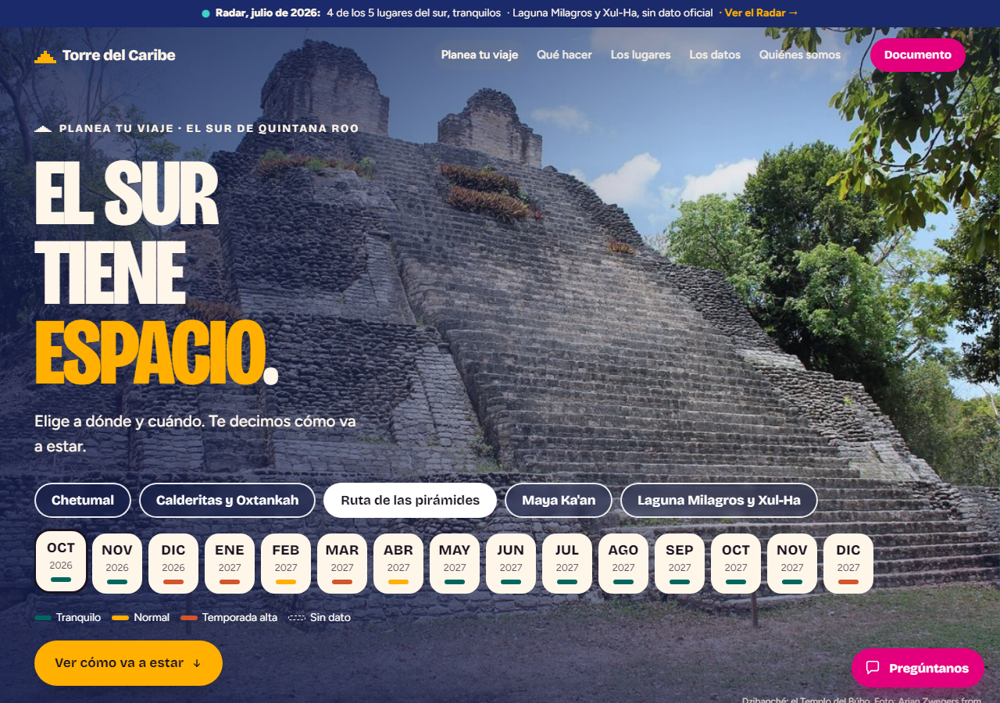

**Fotos comprobadas de cada lugar.** Cada uno de los cinco lugares tiene de 4 a 6 fotos, 28 en total. Todas tienen
licencia libre, llevan su crédito y **se tomaron dentro del municipio del lugar**. Eso se comprobó con la ubicación
grabada en cada foto, contra el mapa oficial de los municipios. Una foto que dice "Kohunlich", pero cuya ubicación cae a
más de 100 km, se descartó.

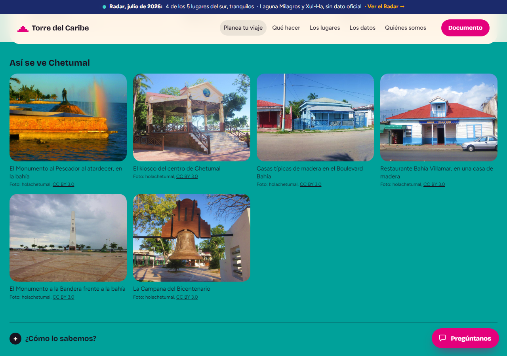

**Un error corregido.** Un día antes se había agregado una galería de platillos típicos. Sus fotos eran de Mérida,
Campeche y otros lugares de la península, no de Quintana Roo, y eso va contra la regla de mostrar solo los cinco lugares.
La galería se retiró.

**Huecos que se declaran**
- No existen fotos de platillos con licencia libre tomadas en los cinco lugares. Lo que sí hay son fotos de restaurantes
  reales, como uno en una casa de madera en Chetumal y los de Calderitas. Para mostrar platillos del sur hacen falta fotos
  propias o fotos con permiso.
- Tampoco hay reseñas de viajeros de estos lugares que se puedan usar. Por eso la página no muestra reseñas.

## 7. El planteamiento con datos (Fase 3)

### 7.1 Qué se hace y por qué
Las cinco regiones se eligieron primero con noticias y con las visitas a las zonas arqueológicas. En esta fase se
comprueba con datos oficiales que cumplen los cinco criterios de selección: sin sargazo, sin cierres, sin saturación,
con servicios suficientes y con datos para medirlas. Cancún, Playa del Carmen y Tulum aparecen al lado solo para
comparar.

### 7.2 Dos reglas que se fijaron
- **Cuánta gente vive en cada región** se cuenta por pueblo, con el Censo 2020, y no por municipio. Así cada región
  tiene su propia cifra, aunque cuatro compartan municipio.
- **Una zona arqueológica pasa el criterio de cierres** si lleva al menos 12 meses seguidos abierta y no cerró en 2026.
  Las zonas del sur cerraron por obras en 2024, pero ya llevan entre 18 y 21 meses abiertas. Muyil solo llevaba 6
  meses, por eso quedó fuera.

### 7.3 El resultado
| Región | Sargazo | Cierres (meses seguidos abierta) | Ocupación 2024 | Visitantes INAH por residente | Negocios turísticos por 1,000 hab. | Viviendas sin drenaje | Series oficiales |
|---|---|---|---:|---:|---:|---:|---:|
| Chetumal | vigilancia | pasa (sin zona INAH) | 58.0 % | — | 8.5 | 1.1 % | 4 |
| Bahía Calderitas–Oxtankah | vigilancia | pasa (21) | sin dato | 2.0 | 12.6 | 1.4 % | 3 |
| Ruta arqueológica del sur | no aplica | pasa (18) | sin dato | 10.9 | 10.5 | 4.8 % | 3 |
| Maya Ka'an + Kantemó | no aplica | pasa (sin zona INAH) | 38.6 % | — | 8.7 | 5.1 % | 4 |
| Laguna Milagros–Xul-Ha | no aplica | pasa (sin zona INAH) | sin dato | — | 0.5 | 1.0 % | 2 |
| *Cancún (referencia)* | afectada | pasa (13) | 76.1 % | 0.1 | 5.7 | 1.7 % | 5 |
| *Playa del Carmen (referencia)* | afectada | pasa | 76.9 % | — | 6.4 | 4.1 % | 4 |
| *Tulum (referencia)* | afectada | **no pasa** (cierres de negocios 2026) | 73.7 % | 30.9 | 26.5 | 3.2 % | 5 |

*Tabla 1. Criterios de selección calculados con datos. Fuentes: SITUR-Q, INAH, INEGI (Censo 2020 y DENUE) y
noticias verificadas para el sargazo.*

**Qué dice la tabla:**
- Las cinco regiones pasan los criterios de sargazo y de cierres.
- En 2024, los hoteles de Chetumal ocuparon el 58 % de sus cuartos y los de Maya Ka'an el 39 %; en el norte, entre 74 y
  77 %. En el sur hay espacio.
- La ruta de las pirámides recibe casi 11 visitantes por habitante al año: la tercera parte que Tulum. Sus pueblos son
  pequeños, así que la campaña debe ponerle un límite.
- Laguna Milagros y Xul-Ha casi no tiene negocios turísticos y es la región con menos datos. Se promueve con cuidado,
  como visita desde Chetumal.

### 7.4 Variables, actores y relaciones
Un planteamiento con datos nombra **qué se mide** (variables), **quién participa** (actores) y **cómo se relacionan**,
cada cosa con una cifra. El proyecto lo hace en un cuaderno de trabajo (`notebooks/01_planteamiento.ipynb`) que lee las
tablas limpias y calcula todo.

**Variables.** Hay 17 variables oficiales, clasificadas por su papel:
- **9 de presión** (la gente que llega): pasajeros de avión, Tren Maya, cruceristas, cruces con Belice, visitantes a
  zonas arqueológicas y ocupación hotelera.
- **3 de capacidad** (lo que se puede recibir): cuartos de hotel, hoteles y negocios turísticos.
- **2 de la comunidad:** población y viviendas con drenaje.
- **3 huecos declarados:** la afluencia de turistas y las dos series de derrama económica, que la fuente dejó de
  publicar en marzo de 2024 y que, en el caso de la derrama, no dicen su unidad.

**Actores**, cada uno con una cifra medida:
- **Comunidades** de los cinco lugares: 229,247 habitantes.
- **Negocios turísticos** en esas localidades: 1,966.
- **Tren Maya:** 58,086 personas bajaron en Chetumal y Maya Ka'an en 2025.
- **Frontera con Belice:** 653,306 cruces en 2025.
- **INAH:** 77,645 visitantes en 2025 a las 4 zonas de la campaña.
- **Gobierno de Quintana Roo:** 12 indicadores publicados.
- **Secretaría de Turismo:** 7 centros turísticos del norte medidos cada semana.

Falta un actor con datos propios, el visitante como persona (de dónde viene y qué valora). Entra en la fase de la
campaña, con las nacionalidades que registran los aeropuertos y reseñas públicas.

**La relación central: ¿qué tan concentrado está el turismo?** Para cada dimensión se calculó qué parte del total del
estado tiene la unidad más grande y qué parte tienen los cinco lugares. Se usó el **índice de Herfindahl-Hirschman**, la
medida estándar de concentración. Se calcula sumando los cuadrados de las partes de cada unidad y va de 0 (todo
repartido parejo) a 1 (todo en un solo lugar).

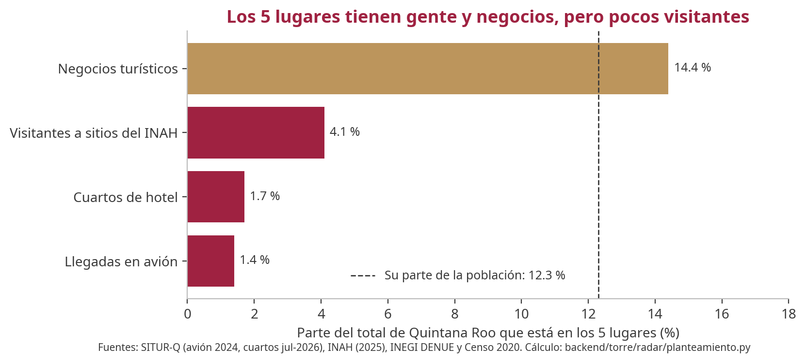

*Figura 7. Parte del total de Quintana Roo que está en los cinco lugares, comparada con su parte de la población.
Fuentes: gobierno de Quintana Roo (SITUR-Q), INAH e INEGI (DENUE y Censo 2020).*

**Qué muestra la gráfica:**
- En los cinco lugares vive el **12.3 %** de la gente del estado y está el **14.4 %** de sus negocios turísticos.
- Pero ahí llega el **1.4 %** de los pasajeros de avión, está el **1.7 %** de los cuartos de hotel y va el **4.1 %** de
  los visitantes del INAH.
- La concentración más fuerte es la del avión: **9 de cada 10 pasajeros** entran por Cancún (índice de 0.81 de 1).
- Los negocios siguen a la población; los visitantes, no. Esa es la relación que la campaña busca mover. Una
  precaución al leerlo: muchos de esos negocios, sobre todo los restaurantes de Chetumal, también atienden a los
  residentes.

**Un cuidado al sumar cuartos de hotel.** El sistema estatal publica zonas (Riviera Maya, Grand Costa Maya) y destinos
dentro de ellas. Se comprobó que una zona no siempre es la suma de sus destinos: la Riviera Maya tiene 36,709 cuartos más
que Playa del Carmen y Tulum juntos, porque incluye lugares que no se publican por separado. Por eso el total del
estado (140,664 cuartos en julio de 2026) se suma con los destinos y las zonas, sin repetir y sin perder cuartos.

### 7.5 Estado de la fase
Los tres entregables de la fase están listos: la tabla de criterios, el planteamiento con variables, actores y
relaciones, y la regla para medir el sur sin ocupación oficial. La siguiente fase, el Radar, necesita dos decisiones
del equipo: cuánto pesa cada variable en el índice de presión y dónde van los cortes entre "tranquilo", "concurrido" y
"saturado".

## 8. El Radar: ¿dónde hay presión y dónde hay espacio? (Fase 4)

### 8.1 Qué hará el Radar
El Radar calificará cada lugar, mes por mes, con un **índice de presión turística** de 0 a 1 y lo traducirá a palabras
de todos los días: **tranquilo, concurrido o saturado**. Además, un modelo de aprendizaje de máquina estimará qué
estado se espera en los meses siguientes. La campaña lo usa para decidir dónde anunciar: un lugar "saturado" no se
promueve.

### 8.2 Tres decisiones del equipo
- **Todas las variables pesan lo mismo.** Después se prueba qué pasa si cada peso sube o baja a la mitad, para saber si
  el resultado depende de esa elección. Así el norte no gana peso solo por tener más datos publicados.
- **Los cortes son los mismos para todo el estado.** Se calculan con los datos de todos los lugares juntos: por debajo
  de la mitad de los valores, "tranquilo"; por encima del 90 %, "saturado". Así un lugar que nunca se llena no aparece
  "saturado" solo por compararse contra sí mismo.
- **Se predicen los estados futuros con los datos existentes**, con modelos que se comparan entre sí y se prueban con
  meses que el modelo no vio.

### 8.3 Primer paso: la tabla mensual del Radar
Se armó una tabla con 15 lugares (los 5 de la campaña y 10 destinos del resto del estado como referencia) y 55 meses,
de enero de 2022 a julio de 2026. Para cada lugar y mes guarda las personas que bajaron del Tren Maya, los
cruceristas, los cruces desde Belice, los visitantes a zonas arqueológicas, la ocupación hotelera y los cuartos de
hotel.

**Un hallazgo al armarla:** el sistema estatal publica "visitantes a zonas arqueológicas" por destino, pero esas
cifras son las mismas del INAH, sumadas. Por ejemplo, las 39,459 visitas que el sistema estatal da a Chetumal en 2025
son exactamente Oxtankah (11,017) + Kohunlich (21,850) + Dzibanché (6,592). Usar las dos fuentes habría contado dos
veces a los mismos visitantes. Por eso se usa solo el INAH, zona por zona, y cada zona se asigna a un solo lugar.

**Qué datos tiene cada uno de los cinco lugares:**
- **Chetumal:** Tren Maya, cruces con Belice y cuartos de hotel.
- **Calderitas–Oxtankah** y la **Ruta de las pirámides:** solo los visitantes de sus zonas arqueológicas.
- **Maya Ka'an:** Tren Maya y cuartos de hotel.
- **Laguna Milagros–Xul-Ha:** ninguna serie oficial. El Radar la mostrará como "sin dato oficial", nunca como
  "tranquila", porque no saber no es lo mismo que haber medido poca gente.

**Una corrección al armarla.** El sistema estatal publica la ocupación hotelera en tres renglones por mes: cuartos
disponibles, cuartos ocupados y el porcentaje. La primera versión de la tabla los sumaba, lo cual daba cifras
imposibles. Se corrigió: el porcentaje se calcula como cuartos ocupados entre cuartos disponibles (58.0 % en Chetumal
en 2024, igual que en el capítulo 7), y una prueba automática impide que el error regrese.

### 8.4 El índice de presión y los estados
El índice se calcula en cuatro pasos:
1. **Llegadas por cada mil habitantes y por cada cuarto de hotel.** Las personas que bajan del Tren Maya, los
   cruceristas y los visitantes de las zonas arqueológicas se dividen entre la población del lugar, porque mil
   visitantes pesan más en un pueblo de 6,000 habitantes que en una ciudad de 169,000. Las llegadas en tren y crucero
   también se dividen entre los cuartos de hotel, para medir la presión sobre el hospedaje. A eso se suma la ocupación
   hotelera.
2. **La misma escala para todo.** Cada medida se pasa a una escala de 0 a 1: 0 es el valor más bajo registrado en todo
   el estado y 1 el más alto.
3. **Promedio.** El índice es el promedio de las medidas que el lugar tiene ese mes; todas pesan lo mismo.
4. **Estado.** Si el índice queda en la mitad baja de todos los valores del estado, el lugar está "tranquilo"; si
   queda en el 10 % más alto, "saturado"; en medio, "concurrido".

**Una prueba de validez que obligó a corregir.** La primera versión calificó a Cancún como "tranquilo" en julio de
2026, aunque la Secretaría de Turismo registra 68.8 % de sus cuartos ocupados ese mes. La causa: el sistema estatal
dejó de publicar ocupación en 2025, y sin ese dato a Cancún solo lo medían las llegadas en tren entre casi 900 mil
habitantes. Se compararon cuatro variantes con datos reales y se eligió la que ordena bien a los lugares conocidos:
- **Se agregó la ocupación semanal de la Secretaría de Turismo** para Cancún, Playa del Carmen, Cozumel e Isla Mujeres.
  Cubre 2022–2026 y cada lugar usa una sola fuente en toda su historia.
- **Una medida entra al índice solo si la tienen al menos dos lugares.** Los cruces con Belice solo existen en
  Chetumal. Al compararse solo contra sí mismos, inflaban el índice de Chetumal por encima del de Cancún. Siguen en la
  página, pero no en el índice.

**Resultado de julio de 2026:**
- Los lugares más presionados son Mahahual (por los cruceros), Isla Mujeres y Bacalar.
- Los cinco lugares de la campaña están "tranquilos", con índices entre 0.01 y 0.13.
- La Laguna Milagros aparece como "sin dato oficial".

**Qué tan sólido es:** si el peso de cualquiera de las medidas sube o baja a la mitad, cambia de estado a lo más el
6 % de los casos. La elección de pesos iguales no decide el resultado.

**Tres limitaciones que se declaran:**
- **Quiebre de 2025.** Chetumal, Puerto Morelos y Maya Ka'an solo tenían la ocupación del sistema estatal, que termina
  en 2024. En 2025 su índice cae (Chetumal de 0.54 a 0.03), pero no porque llegara menos gente: perdieron una de sus
  medidas. La predicción lo trata con el índice comparable (sección 8.5).
- **Las llegadas por cuarto dependen sobre todo de los cruceros.** Mahahual recibe hasta 432 cruceristas por cuarto de
  hotel al mes, y esos pasajeros no duermen en hoteles. Por eso, para casi todos los demás lugares esta medida vale
  cerca de 0. El equipo decidió conservarla así y declararlo.
- **Dos fuentes que no miden igual.** Para los mismos lugares y meses, la Secretaría de Turismo registra menos
  ocupación que el sistema estatal (hasta 19 puntos menos en Isla Mujeres). Como el Radar usa la de la Secretaría para
  el norte, el norte puede verse un poco más vacío de lo que está. La conclusión de que el sur tiene espacio no cambia.

### 8.5 ¿Se puede anticipar el estado del mes siguiente?
**Un índice que no cambia de reglas.** Para no confundir la falta de un dato con la falta de visitantes, se construyó
un **índice comparable**: cada lugar se mide siempre con las mismas medidas, las que tiene hoy. Chetumal, por ejemplo,
se mide con las personas que bajan del Tren Maya desde diciembre de 2024. Este es el índice que publica el Radar, con
cortes de 0.19 (entre tranquilo y concurrido) y 0.76 (entre concurrido y saturado). Con él, en julio de 2026 Cancún
(0.19) y Cozumel aparecen "concurridos", y los cinco lugares de la campaña siguen "tranquilos".

**Cuatro formas de predecir, puestas a prueba.** Se compararon tres modelos de aprendizaje de máquina (regresión
logística, Random Forest y Gradient Boosting) contra la regla más simple posible, la **persistencia**: "el mes que viene
estará igual que este". La prueba fue estricta: para cada uno de los últimos 12 meses (agosto de 2025 a julio de 2026)
cada modelo aprendió solo con los meses anteriores y predijo ese mes, sin haberlo visto nunca.

| Forma de predecir | Aciertos (de 156) | Cambios que anticipó (de 30) | Falsas alarmas |
|---|---:|---:|---:|
| Persistencia | 126 | 0 | 0 |
| **Regresión logística (elegida)** | **130** | **8** | **4** |
| Random Forest | 130 | 6 | 2 |
| Gradient Boosting | 128 | 7 | 5 |

**Lo que dice la prueba, sin adornos:**
- El estado de un lugar se repite ocho de cada diez meses, así que repetir el mes anterior ya acierta mucho. El
  aprendizaje de máquina agrega poco: cuatro aciertos más de 156.
- Su valor está en que anticipó 8 de los 30 cambios de estado, y la campaña necesita justo eso: saber antes de que un
  lugar se llene.
- La regla para elegir fue la que definió el equipo: el modelo que más acierta y, si hay empate, el que más cambios
  anticipa.

**Un límite importante:** en esos 12 meses, los cinco lugares de la campaña casi no cambiaron de estado (dos cambios en
48 casos), y el modelo no anticipó ninguno. Los cambios que sí anticipa ocurrieron en los lugares de referencia. En el
sur, el modelo todavía no se ha podido poner a prueba de verdad.

**Qué predice para agosto de 2026:**
- Los cinco lugares de la campaña siguen **tranquilos**, con probabilidad cercana al 100 %. La Laguna Milagros sigue
  sin dato oficial.
- Entre los lugares de referencia, Mahahual sigue concurrido, con 40 % de probabilidad de saturarse por los cruceros.

Toda predicción se marca como **estimada**, nunca como medida.

### 8.6 ¿Cuándo se va a llenar el norte? La cadena de Markov
Para el norte existe un dato semanal: la ocupación de los hoteles de siete centros turísticos, medida por la
Secretaría de Turismo desde 2022. Con él se construyó una **cadena de Markov**, un modelo que cuenta cuántas veces un
centro pasó de un estado a otro de una semana a la siguiente y, con esas proporciones, calcula la probabilidad de cada
estado en las semanas por venir.

- En el norte, una semana "tranquila" significa menos de 71.2 % de cuartos ocupados y una "saturada", más de 85.9 %.
- **Los estados duran:** una semana saturada va seguida de otra saturada 73 de cada 100 veces. De tranquilo casi nunca
  se salta directo a saturado (0 de 830 veces).
- A largo plazo, el norte pasa **una de cada diez semanas saturado**.
- **Prueba con las últimas 52 semanas:** la cadena da probabilidades más certeras que la regla "igual que esta semana"
  a 1, 4 y 8 semanas. Donde no mejora es en adivinar una sola etiqueta: su utilidad está en decir "hay 14 % de riesgo",
  no en afirmar "se va a llenar".
- **Semana del 27 de julio de 2026:** Playacar (Playa del Carmen) está concurrida, con 81.7 % de ocupación y 14 % de
  probabilidad de saturarse en cinco semanas. Los otros seis centros están tranquilos.

**Para qué sirve a la campaña:** cuando sube el riesgo de que el norte se sature, es el momento de mostrarle el sur a
quien planea ir al norte. Esa regla la ejecutará la Torre en vivo en la Fase 7. El sur no tiene datos semanales, así
que la cadena solo cubre al norte y así se declara.

### 8.7 El Radar en la página
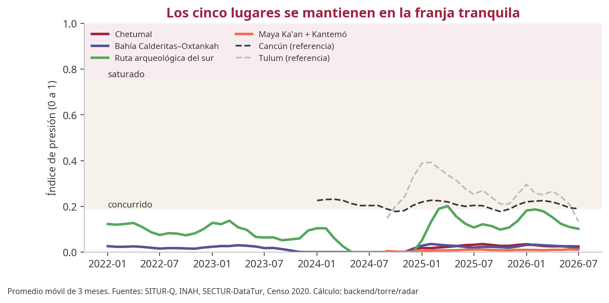

*Figura 8. Índice de presión comparable, 2022–2026 (promedio de 3 meses). Las franjas marcan "concurrido" y
"saturado"; debajo, "tranquilo". La Laguna Milagros no aparece porque no tiene dato oficial. Los ceros de 2024 en la
Ruta de las pirámides y Oxtankah son los meses en que esas zonas estuvieron cerradas por obras. Fuentes: SITUR-Q, INAH,
Secretaría de Turismo (DataTur) y Censo 2020.*

**Qué muestra la gráfica:**
- Los cuatro lugares de la campaña con datos se mantienen siempre en la franja tranquila.
- Cancún y Tulum, solo como referencia, se mueven entre tranquilo y concurrido.
- La línea de Chetumal empieza en diciembre de 2024, cuando llegó el Tren Maya: antes no tenía las mismas medidas.

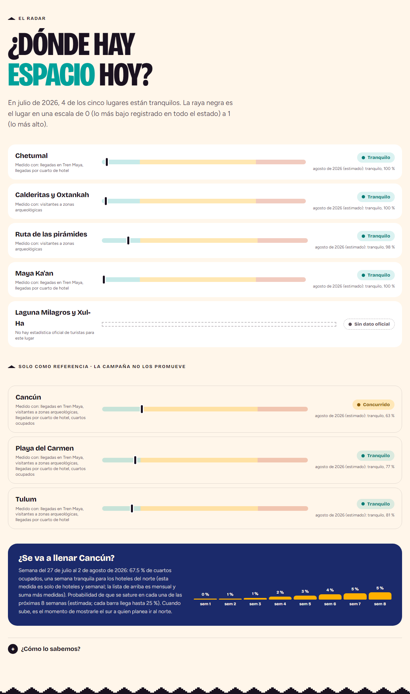

*Captura 10. La sección "¿Dónde hay espacio hoy?" de la página.*

**Cómo se ve el Radar en la página.** La sección "¿Dónde hay espacio hoy?" muestra:
- **Los cinco lugares**, cada uno con una barra de colores (tranquilo, concurrido, saturado), una raya que marca dónde
  está ese mes, el estado escrito en palabras y el estado estimado para el mes siguiente con su probabilidad. Cada
  lugar dice con qué medidas se calculó. La Laguna Milagros aparece con la barra punteada y la leyenda "sin dato
  oficial".
- **Cancún, Playa del Carmen y Tulum**, bajo el título "Solo como referencia · la campaña no los promueve".
- **La probabilidad semanal de que Cancún se sature** en las próximas ocho semanas, calculada con la cadena de Markov.
- **Un apartado "¿Cómo lo sabemos?"** que explica el cálculo y los resultados de la prueba del modelo.

Además, la ficha de cada lugar en el mapa 3D lleva su semáforo del mes y el estado estimado del mes siguiente. Si algún
día faltan las salidas del Radar, la página simplemente no dibuja la sección: nunca muestra un número que no existe.

### 8.8 El norte comparado con el resto del país
Para ubicar al norte de Quintana Roo en el mapa nacional, se agruparon los centros turísticos que mide la Secretaría
de Turismo. La comparación se hizo por su patrón de ocupación a lo largo del año: qué tan llenos están y en qué meses.
Se usó un método llamado **agrupamiento jerárquico**, que va uniendo a los centros más parecidos. El número de grupos
se eligió con una medida de qué tan bien separados quedan (la "silueta").

- Entraron **55 centros** con sus 55 meses completos, de 2022 a 2026. Otros 41 quedaron fuera porque les faltan meses:
  32 solo tienen tres meses publicados y 9 tienen meses vacíos. No se rellenó ningún dato.
- La mejor separación es en **dos grupos**:
  - **Destinos muy ocupados** (23 centros, 64.5 % en promedio): Cancún, la Riviera Maya, Playacar, Akumal, Playa del
    Carmen y Los Cabos.
  - **El resto del país** (32 centros, 41.1 %): Cozumel e Isla Mujeres, junto con ciudades como Morelia, Oaxaca y
    Guadalajara.

**Qué significa para la campaña:** el norte de Quintana Roo pertenece al grupo de los destinos más llenos del país.
Los cinco lugares del sur no aparecen en esta medición porque la Secretaría no los mide, y así se declara.

### 8.9 Revisión completa de las fases 1 a 4
Antes de seguir, se revisó el trabajo de las fases 1 a 4 contra el plan aprobado:
- **Todo se puede reproducir.** Al volver a correr el código desde cero, las ocho tablas de resultados salieron
  idénticas.
- **Las cifras escritas coinciden con los cálculos.** Una prueba automática compara 21 cifras de los documentos con
  lo que calcula el código; todas coinciden, y la prueba avisará si alguna deja de coincidir.
- **Faltaban tres cosas del plan y se agregaron:** las llegadas por cuarto de hotel dentro del índice, el agrupamiento
  de los centros del país y la revisión del sesgo del modelo entre el sur y el resto del estado.
- **Queda pendiente la limpieza de siete fuentes** (clima, huracanes, tipo de cambio, nacionalidades, reseñas, vuelos
  y cruceros) y el catálogo de datos. Las tres primeras se necesitan para la siguiente fase, el pronóstico, así que se
  terminan antes.

El detalle está en la nota `docs/decisiones/09-auditoria-fases-1-4.md`.

---

## 9. El Pronóstico: ¿cuándo conviene ir? (Fase 5)

### 9.1 Qué hará el Pronóstico
El Radar dice dónde hay espacio hoy. El Pronóstico mira de 1 a 12 meses hacia adelante:
- cuántos visitantes se esperan en cada lugar cada mes, con un rango en el que se acierta 9 de cada 10 veces;
- en qué meses hay riesgo de tormenta;
- cómo sería un escenario malo, uno probable y uno bueno.

Con eso, la campaña decide en qué meses anunciar cada lugar y cuánto dinero reservar.

### 9.2 Dos decisiones del equipo
**Qué se pronostica.** El sur no tiene ocupación hotelera oficial desde 2025. Por eso se pronostican solo cifras
**medidas** que llegan hasta 2026:
- los visitantes de las zonas arqueológicas de la Bahía (Oxtankah) y de la Ruta del sur (Kohunlich, Dzibanché e
  Ichkabal), con 127 meses cada una, de enero de 2016 a julio de 2026;
- los cruces desde Belice por Chetumal, con 90 meses;
- la ocupación hotelera de Cancún, con 55 meses. Cancún no se promueve; sirve para saber cuándo hay más turistas en el
  norte, que es el público de la campaña.

Maya Ka'an y Laguna Milagros no tienen una serie mensual propia. Solo recibirán el calendario de lluvia y tormentas.

**Qué hacer con los meses cerrados.** Las zonas arqueológicas cerraron por la pandemia en 2020 y por obras en 2024, y la
frontera con Belice estuvo casi cerrada de 2020 a 2022. Un mes cerrado no significa que nadie quisiera ir. Si el modelo
aprendiera de esos ceros, creería que en abril puede haber cero visitantes. El equipo decidió **marcar esos meses y no
usarlos para aprender**, aunque su cifra se conserva. De los 127 meses de cada zona se usan 90 y 91; de los 90 de
Belice, 62. En Belice también se apartaron marzo a junio de 2022: la frontera ya había reabierto, pero los cruces seguían
recuperándose (de 65 % a 82 % de lo normal). Desde julio de 2022 no bajaron de 86 %.

### 9.3 La forma del año
El primer resultado es la **forma del año** de cada lugar: cuánto sube o baja cada mes frente a un mes promedio. Se
calcula solo con años completos, sin cierres ni pandemia. Un índice de 1.30 significa 30 % más visitantes que en un mes
promedio; uno de 0.70, 30 % menos.

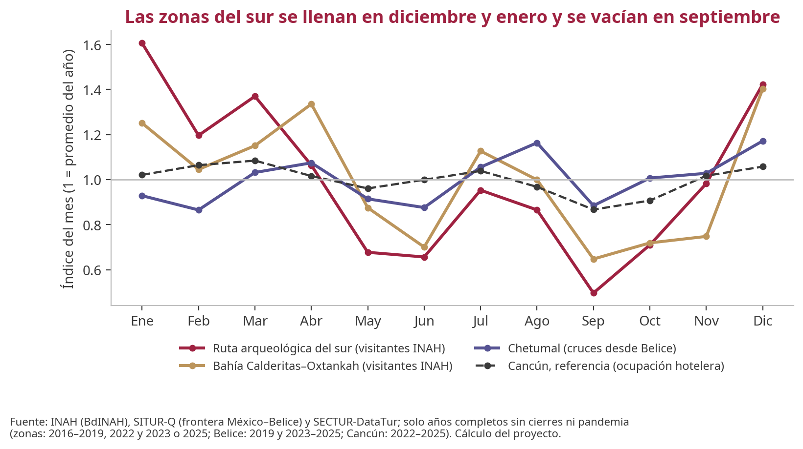

Lo que muestran los datos:
- **Las zonas arqueológicas del sur viven una temporada muy marcada.** En la Ruta del sur, enero recibe 61 % más
  visitantes que un mes promedio y septiembre, la mitad. Diciembre, enero y marzo son los meses altos; mayo, junio y
  septiembre, los bajos.
- **El sur sube y baja al mismo tiempo que el norte.** Si la forma del año del sur fuera idéntica a la de Cancún, el
  parecido valdría 1. En la Ruta vale 0.83 y en la Bahía, 0.72. Los visitantes llegan en las mismas temporadas en todo
  el estado.
- **Chetumal va por su cuenta.** Los cruces desde Belice suben en diciembre, agosto y abril, y su parecido con Cancún es
  de apenas 0.26. Su temporada es más suave: el mes más alto está 17 % arriba del promedio y el más bajo, 13 % abajo.
- **Septiembre es el mes más bajo en las zonas y en Cancún**, y coincide con el pico de tormentas visto en la sección
  5.6.

**Cómo se comprobó.** El resultado se contrastó con un segundo método (STL), que solo acepta series sin huecos. En las
zonas arqueológicas y en Cancún los dos métodos coinciden casi por completo (0.96 de parecido). En Belice, al principio
no (0.45): el tramo sin huecos empezaba en marzo de 2022, cuando los cruces iban a dos tercios de lo normal, y el
segundo método confundía la recuperación con temporada. Al apartar esos meses de recuperación, los dos métodos coinciden
(0.85).

### 9.4 ¿Cuántos visitantes se esperan? Cinco formas de pronosticar
Se probaron cinco formas de pronosticar. La más simple, la **línea base**, supone que cada mes será igual al mismo mes
del año anterior. Las otras cuatro son modelos estadísticos y de aprendizaje de máquina:
- dos versiones de **Holt-Winters**, un método que sigue el nivel de la serie y le suma la forma del año;
- una **regresión con clima**, que combina el nivel de cada reapertura, el mes, la lluvia y las tormentas;
- **Gradient Boosting**, un conjunto de árboles de decisión que aprende de los meses anteriores.

**Cómo se comparan sin hacer trampa.** Se "regresó el reloj" a cada mes desde 2019. Con la información que había ese día
se pronosticaron los 12 meses siguientes, y después se comparó con lo que realmente pasó. Así se reunieron entre 366 y
438 pronósticos por lugar. Ningún modelo pudo usar datos del futuro.

**Qué tan lejos se equivocan.** A cada pronóstico se le da un **rango del 90 %**: un mínimo y un máximo entre los que
debería caer el valor real 9 de cada 10 veces. El proyecto midió cuántas veces se cumplió de verdad:
- Belice: 94 de cada 100.
- Bahía: 91 de cada 100.
- Ruta arqueológica del sur: 80 de cada 100.

En la Ruta la falla se concentró en 2023, cuando las visitas cayeron 11 % sin que nada en los años anteriores lo
anticipara.

**El modelo elegido.** El responsable técnico eligió, para cada lugar, el modelo que menos se equivoca **siempre que su
rango se cumpla al menos 80 de cada 100 veces**. Para los tres lugares del sur ganó la regresión con clima, que se
equivoca entre 10 % y 26 % menos que la línea base. Para Cancún, que cambia poco de un año a otro, ganó la línea base.

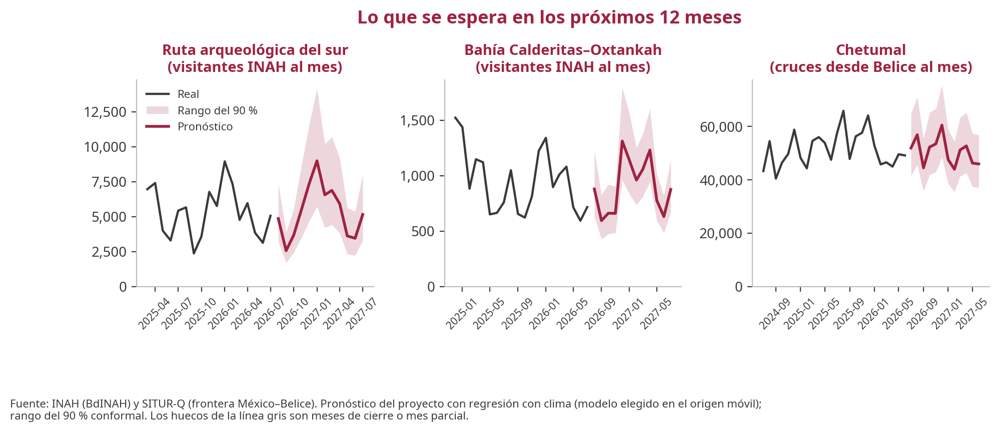

**Lo que se espera.** En los próximos 12 meses:
- La Bahía (+0.6 %) y la Ruta (+2.1 %) mantendrían un nivel parecido al del último año.
- Los cruces desde Belice bajarían 4.9 %, en línea con lo que ya se ve en 2026.
- Ejemplo: en diciembre de 2026 la Bahía recibiría alrededor de 1,311 visitantes, muy probablemente entre 959 y 1,793
  (en diciembre de 2025 fueron 1,224).

**Tres hallazgos honestos**
- **Un modelo "más sofisticado" no siempre gana.** Holt-Winters con tendencia llegó a pronosticar visitantes negativos,
  porque aprendió la tendencia en plena reapertura. Gradient Boosting, con tan pocos datos, quedó por detrás de la línea
  base en la Bahía y en la Ruta.
- **El clima casi no mejora el pronóstico,** porque nadie conoce la lluvia de dentro de seis meses. Sí sirve para medir
  su efecto: en la Bahía, un mes con 100 mm más de lluvia de lo normal tiene cerca de 11 % menos visitantes. Ese dato se
  usará en los escenarios.
- **El efecto de las tormentas no se puede medir con estas series,** porque solo hubo tres meses con tormenta en los
  años usados. Se declara como límite.

### 9.5 ¿Y si sale mejor o peor? Escenarios y riesgo de tormenta
**Riesgo de tormenta por mes.** Con las 31 tormentas que afectaron al sur desde 1966 se calculó la probabilidad de cada
mes:
- agosto: 13.9 %;
- septiembre: 12.5 %;
- octubre: 9.5 %;
- de diciembre a abril: 0 %.

La probabilidad de que llegue al menos una en el año es de 40 %.

**Diez mil futuros posibles.** Para cada lugar se simularon 10,000 versiones de los próximos 12 meses. Cada una combina
el pronóstico con un año completo de errores reales del pasado y con tormentas sorteadas según su probabilidad. Con eso
se arman tres escenarios: **malo** (solo 1 de cada 10 futuros sale peor), **probable** (la mitad sale peor y la mitad
mejor) y **bueno** (solo 1 de cada 10 sale mejor). Estos escenarios **no incluyen la campaña**: muestran lo que pasaría
de todos modos. La campaña se suma en la siguiente fase.

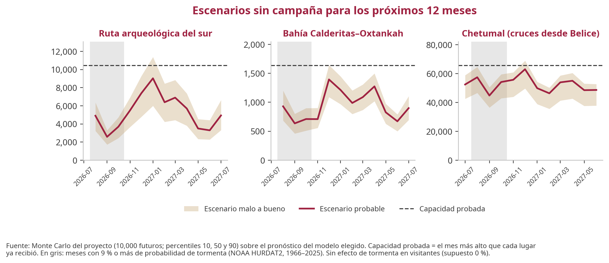

| Lugar | Escenario malo | Escenario probable | Escenario bueno |
|---|---:|---:|---:|
| Ruta arqueológica del sur (visitantes en el año) | 55,811 | 62,212 | 73,884 |
| Bahía Calderitas–Oxtankah (visitantes en el año) | 10,106 | 11,217 | 13,085 |
| Chetumal (cruces desde Belice en el año) | 551,986 | 620,304 | 671,956 |

**Qué tanto pesa una tormenta.** Los datos no alcanzan para medir cuántos visitantes se pierden cuando llega una
tormenta, así que el equipo lo probó como **supuesto**: que el mes de la tormenta pierda 25 % o 50 % de visitantes. Aun
con el supuesto más duro, el escenario probable del año baja apenas entre 1 % y 2 %. Las tormentas pesan en el mes en
que llegan, no en el año. Por eso la reserva para imprevistos se planeará por mes, de agosto a octubre.

**Cuándo hay riesgo de pasarse.** Se tomó como referencia la **capacidad probada**: el mes con más visitantes que cada
lugar ha recibido en su historia (no es la capacidad física oficial). El riesgo de rebasarla aparece en los meses de
temporada alta:
- diciembre de 2026 en Chetumal (29 %);
- diciembre de 2026 en la Bahía (14 %);
- enero de 2027 en la Ruta (30 %).

La campaña no debería empujar esos lugares justo en esos meses.

**Qué más mueve a los visitantes.**
- **La lluvia:** en la Bahía, cada 100 mm de lluvia por arriba de lo normal coincide con cerca de 10 % menos visitantes,
  y en los cruces desde Belice con 5 % menos.
- **El tipo de cambio:** en la Ruta arqueológica, cada peso más por dólar coincide con cerca de 7 % más visitantes.
- En cambio, no se encontró relación entre el precio del dólar y los cruces desde Belice.

Son asociaciones que se repiten en los datos, no pruebas de causa.

## Glosario

| Término | Significado sencillo |
|---|---|
| **Bronze / Silver / Gold** | Tres "cajones" de datos: Bronze guarda los archivos tal como vienen de la fuente; Silver, los datos limpios y ordenados; Gold, las tablas listas para los modelos y la página web |
| **Huella SHA-256** | Código único que identifica un archivo; si cambia un solo dato, la huella cambia. Sirve para probar que un archivo es el original |
| **Parquet** | Formato de archivo que guarda tablas comprimidas y rápidas de leer |
| **PySpark** | Herramienta para procesar grandes volúmenes de datos dividiendo el trabajo en partes |
| **Sargazo** | Alga marina que llega en grandes cantidades a las playas del Caribe y afecta el turismo |
| **API** | "Ventanilla" automática de un sitio web que entrega datos a otros programas |
| **Dato faltante (hueco)** | Casilla sin información en la fuente; se marca como faltante y nunca se rellena con un valor inventado |
| **CPC / CTR** | Costo por clic (lo que se paga cada vez que alguien da clic en un anuncio) / tasa de clics (de cada 100 personas que ven el anuncio, cuántas dan clic) |
| **DENUE** | Directorio Estadístico Nacional de Unidades Económicas del INEGI: lista de todos los negocios del país con su giro y ubicación |
| **Manifiesto** | Tabla de control que anota cada archivo descargado: origen, fecha, tamaño, registros y huella |
| **Navegador automatizado (Playwright)** | Programa que abre páginas web igual que una persona para copiar los datos visibles y guardar capturas como prueba |
| **SCIAN** | Clasificación oficial de actividades económicas (usada por el INEGI): cada giro tiene un código; por ejemplo, 721 es alojamiento y 722 es restaurantes y bares |
| **Registro** | Una fila de una tabla (por ejemplo, un negocio, una reseña o un mes de un destino) |
| **Índice de Herfindahl-Hirschman** | Medida de concentración: suma los cuadrados de la parte que tiene cada lugar. Cerca de 0, todo está repartido; cerca de 1, casi todo está en un solo lugar |
| **Variable / actor** | Variable: algo que se mide (por ejemplo, pasajeros que llegan). Actor: quien participa y toma decisiones (por ejemplo, las comunidades o el INAH) |
